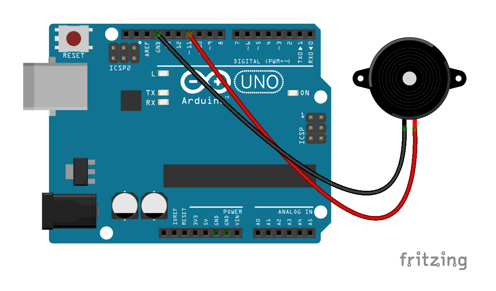

# Songs for playing on Arduino boards.

## Usage

Every code here should run on every arduino board without problems. The sketches rely solely on the tone() function from Arduino, so the sounds are all monophonic. On the bright side, **libraries are not required**.

If you want to compare the code with the original score, I try to group the notes in measures with lines and into staves with groups of lines. However, in some cases notes will be tied together among measures or be dotted and this rule is broken.

## Hardware

Just connect an piezo to the board and you are good to go. Pin 11 is used in every sketch because some piezo speakers can be connected between it and the close GND pin without any wiring.

There are two kinds of piezo buzzers: active and passive. The active one that plays a specific pitch when powevered and are not good for this purpose. The passive kind functions like a speaker, reproducing the pitch you apply to it. You can test the piezo speaker with the "blink" example, the good piezo speaker will just click, while the other kind will play a pitch every other second.  

## List of tunes

### Movies

* [Cantina Band from Star Wars](https://github.com/robsoncouto/arduino-melodies/blob/master/cantinaband/cantinaband.ino)  
* [Imperial March from Star Wars](https://github.com/robsoncouto/arduino-melodies/blob/master/imperialmarch/imperialmarch.ino)
* [Hedwig's theme from Harry Potter](https://github.com/robsoncouto/arduino-melodies/blob/master/harrypotter/harrypotter.ino)
* [Star Wars theme](https://github.com/robsoncouto/arduino-melodies/blob/master/starwars/starwars.ino)
* [Pulo da gaita from the Brazilian Movie *O Auto da Compadecida*](https://github.com/robsoncouto/arduino-melodies/blob/master/pulodagaita/pulodagaita.ino)
  
### Games

* [Bloody Tears from Castlevania II](https://github.com/robsoncouto/arduino-melodies/blob/master/bloodytears/bloodytears.ino)
* [Green Hill Zone from *Sonic the Hedgehog*](https://github.com/robsoncouto/arduino-melodies/blob/master/greenhill/greenhill.ino)
* [Mii channel theme](https://github.com/robsoncouto/arduino-melodies/blob/master/miichannel/miichannel.ino)
* [Professor Layton's theme from *Professor Layton and the Curious Village*](https://github.com/robsoncouto/arduino-melodies)
* [Song of stomrs from *The Legend of Zelda Ocarina of time*](https://github.com/robsoncouto/arduino-melodies/blob/master/songofstorms/songofstorms.ino)
* [Super Mario Bros' overworld theme](https://github.com/robsoncouto/arduino-melodies/blob/master/supermariobros/supermariobros.ino)
* [Tetris theme (Korobeiniki)](https://github.com/robsoncouto/arduino-melodies/blob/master/tetris/tetris.ino)
* [Zelda's Lullaby from *The Legend of Zelda Ocarina of time*](https://github.com/robsoncouto/arduino-melodies/blob/master/zeldaslullaby/zeldaslullaby.ino)
* [The Legend of Zelda for the NES](https://github.com/robsoncouto/arduino-melodies/blob/master/zeldatheme/zeldatheme.ino)

### Classic
* [Cannon in D - Pachelbel](https://github.com/robsoncouto/arduino-melodies/blob/master/cannonind/cannonind.ino)
* [Greensleeves](https://github.com/robsoncouto/arduino-melodies/blob/master/greensleeves/greensleeves.ino)
* [Ode to Joy -  Beethoven's Symphony No. 9](https://github.com/robsoncouto/arduino-melodies/blob/master/odetojoy/odetojoy.ino)
* [Prince Igor - Borodin's Polovtsian Dances](https://github.com/robsoncouto/arduino-melodies/blob/master/princeigor/princeigor.ino)
* [Minuet in G - Christian Petzold](https://github.com/robsoncouto/arduino-melodies/blob/master/minuetg/minuetg.ino)

### Others

* [Asa Branca - Luiz Gonzaga](https://github.com/robsoncouto/arduino-melodies/blob/master/asabranca/asabranca.ino)
* [Pink Panther Theme](https://github.com/robsoncouto/arduino-melodies/blob/master/pinkpanther/pinkpanther.ino)
* [Take on me A-ha](https://github.com/robsoncouto/arduino-melodies/blob/master/takeonme/takeonme.ino)
* [The lick](https://github.com/robsoncouto/arduino-melodies/blob/master/thelick/thelick.ino)
* [The Lion sleeps tonight (*A-weema-weh*)](https://github.com/robsoncouto/arduino-melodies/blob/master/thelionsleepstonight/thelionsleepstonight.ino)
* [Take on me](https://github.com/robsoncouto/arduino-melodies/blob/master/takeonme/takeonme.ino)
* [Keyboard cat](https://github.com/robsoncouto/arduino-melodies/blob/master/keyboardcat/keyboardcat.ino)

## Copyright

Every sketch here has been written by myself, although based on scores I found online or books I own. These scores are linked in each file when possible. You can use the sketches for anything, I only kindly ask that you give credit if you use these codes on a tutorial, video, example, etc. 
